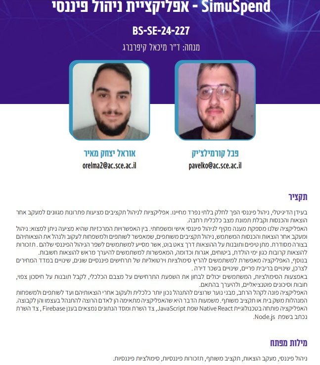
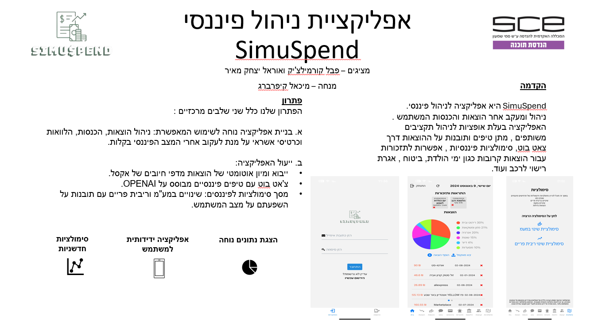
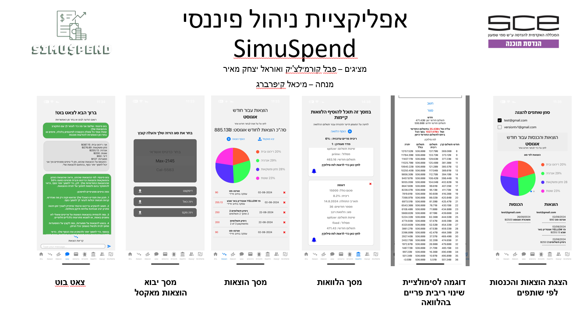

# SimuSpend
SimuSpend is a financial management application. It manages and tracks user expenses and income. The app offers options for managing shared budgets, provides tips and insights on expenses through a chatbot, financial simulations, and reminders for upcoming expenses such as birthdays, insurance, vehicle registration fees, and more.

[Watch the Demo video](https://github.com/p4vele/SimuSpend/blob/main/BS-SE-24-227-2-8/BS-SE-24-227-2-8.mp4)

## Authors: 

Pavel Kormilchik kormilchikpavel@gmail.com

Orel Maier orelmaier@gmail.com
